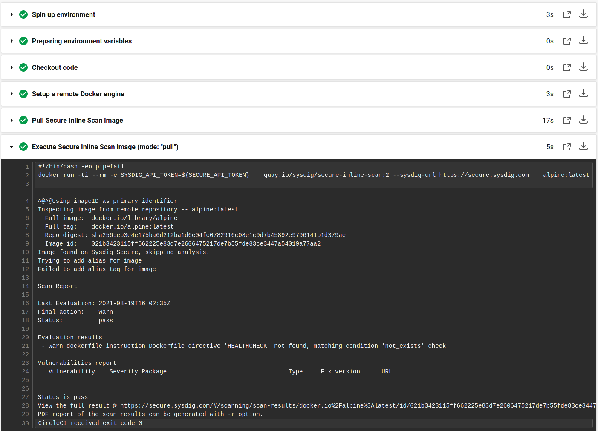
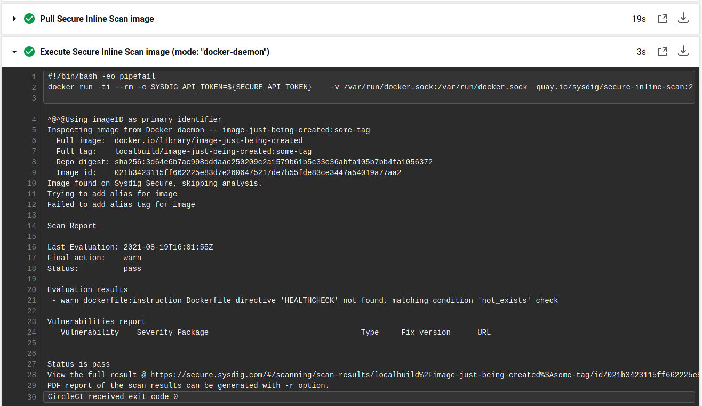
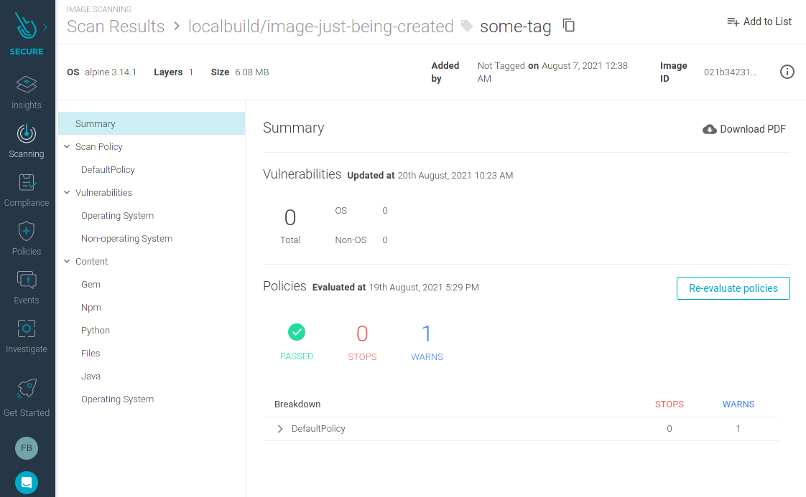

[](https://circleci.com/gh/sysdiglabs/circleci-orb) [](https://circleci.com/orbs/registry/orb/sysdig/sysdig) [](https://raw.githubusercontent.com/sysdiglabs/circleci-orb/master/LICENSE)

# Sysdig Orb for CircleCI

## The Sysdig Orb

Use the Sysdig Orb to consolidate container and host scanning in a single workflow. Automate scanning locally in your
CircleCI pipelines without images leaving your environment and block vulnerabilities pre-deployment.

By utilizing this orb in your workflows, it is possible to
use [Sysdig's Inline Image Scanner](https://docs.sysdig.com/en/integrate-with-ci-cd-tools.html) to detect
vulnerabilities quickly with out-of-the-box Dockerfile best practices, detect mistakes and bad security practices early
and meet regulatory standard frameworks for container compliance like NIST SP 800-190, PCI DSS and HIPAA.

Image scanning can detect problems like:

- No USER command specified which will cause the container to run as root.
- Use “latest” tagged base images that reduce the tracking of the built images.
- Unsafe Dockerfile instructions.
- Vulnerabilities in the base image OS.
- Vulnerabilities in the libraries your language is using (Python pip, Java JARs, Ruby gems, Javascript npm, etc)
- Compliance violations for the NIST 800-190 or PCI standards.

One of the unique benefits of Sysdig Secure Inline Scanning is that only the results will be sent to the Sysdig Secure
backend, where you can review them and have a full tracking of vulnerabilities and configuration checks. Sysdig’s
backend is available as SaaS or air-gapped in your own environment. With this approach, you won’t lose control over your
images as they don’t need to be sent to the backend or exposed to any staging repository.

## How to use the Sysdig Orb

At a minimum, the inline scanner requires a Sysdig Secure v2.5.0+ account (SaaS or On-Prem) with API token access. Check
the [Orbs Introduction](https://circleci.com/docs/2.0/orb-intro/) on how to use Orbs in your CircleCI pipelines. For
more examples on how to configure a workflow with CircleCI and the Sysdig Orb, check below.

## Usage Examples

### Pull and scan image from a existing registry

```yaml
version: 2.1

orbs:
  sysdig: sysdig/sysdig@x.y.z

jobs:
  scan-image-from-registry:
    environment:
      IMAGE_TO_PULL_AND_SCAN: myrepo/myapp:tag
    docker:
      - image: cimg/base:stable
    steps:
      - setup_remote_docker
      - sysdig/inline-image-scan:
          image-tag: ${IMAGE_TO_PULL_AND_SCAN}
          sysdig-secure-token: ${SECURE_API_TOKEN}
          input-type: pull # default, can be omitted
```

### Build and scan in the same pipeline

```yaml
version: 2.1

orbs:
  sysdig: sysdig/sysdig@x.y.z

jobs:
  build-and-scan:
    environment:
      IMAGE_TO_BUILD: myrepo/myapp:tag
    docker:
      - image: cimg/base:stable
    steps:
      - checkout
      - setup_remote_docker
      - run:
          name: Build Docker image
          command: docker build -t ${IMAGE_TO_BUILD} .
      - sysdig/inline-image-scan:
          image-tag: ${IMAGE_TO_BUILD}
          sysdig-secure-token: ${SECURE_API_TOKEN}
          input-type: docker-daemon
```

### Advanced Example

```yaml
version: 2.1

orbs:
  sysdig: sysdig/sysdig@x.y.z

jobs:
  build-and-scan-advanced:
    environment:
      IMAGE_TO_BUILD: myrepo/myapp:tag
    docker:
      - image: cimg/base:stable
    steps:
      - checkout
      - setup_remote_docker
      - run:
          name: Build Docker image
          command: docker build -t ${IMAGE_TO_BUILD} .
      - sysdig/inline-image-scan:
          image-tag: ${IMAGE_TO_BUILD}
          input-type: docker-daemon
          sysdig-secure-token: ${SECURE_API_TOKEN}
          sysdig-secure-url: ${SECURE_API_URL} # Configure this for on-prem instances
          sysdig-skip-tls: true # Skip TLS verification when calling Secure endpoints. Use it only for on-prem instances with self-signed certificates.
          ignore-failed-scan: false # Set to true if you don't want the pipeline to fail
          extra-parameters: "" # Add more extra parameters to the Secure Inline Scanning workflow.
                               # Check out https://docs.sysdig.com/en/integrate-with-ci-cd-tools.html#UUID-8945ddee-8c45-58b4-7d85-e06c4235d03c_section-5d9fc0748d40f-idm45530496679632
```


## Orb Parameters

Full reference docs https://circleci.com/orbs/registry/orb/sysdig/sysdig


| Parameter                | Description                                                                                                  | Required | Default                             | Type    |
| ------------------------ | ------------------------------------------------------------------------------------------------------------ | -------- | ----------------------------------- | ------- |
| image-tag                | Tag of the image to analyse.                                                                                 | yes      | -                                   | string  |
| sysdig-secure-token      | API token for Sysdig Scanning auth.                                                                          | yes      | -                                   | string  |
| sysdig-secure-url        | Sysdig Secure URL                                                                                            | no       | https://secure.sysdig.com           | string  |
| sysdig-skip-tls          | Skip TLS verification when calling secure endpoints.                                                         | no       | false                               | boolean |
| ignore-failed-scan       | Don't fail the execution of this workflow even if the scan result is FAILED.                                 | no       | false                               | boolean |
| input-type               | If specified, where should we scan the image from. Valid values: `pull`, `docker-daemon`.                    | no       | `pull`                              | string  |
| input-path               | Path to the docker socket. It must be an absolute path.                                                      | no       | ""                                  | string  |
| run-as-user              | Run the scan container with this username or UID.                                                            | no       | ""                                  | string  |
| extra-parameters         | Additional parameters added to the secure-inline-scan container execution.                                   | no       | ""                                  | string  |
| extra-docker-parameters  | Additional parameters added to the docker command when executing the secure-inline-scan container execution. | no       | ""                                  | string  |
| secure-inline-scan-image | Sysdig Secure Inline Scan image service                                                                      | no       | quay.io/sysdig/secure-inline-scan:2 | string  |

## Screenshots

### Image pulled and scanned



### Image built and inline scanned



### Scan Results in Sysdig Secure


